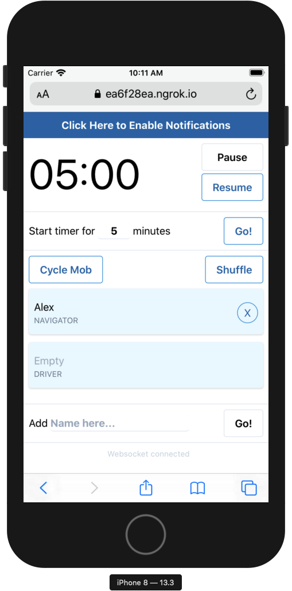

# mobtime

A websocket powered, collaborative mobbing timer.

On your desktop:

<p align="center">
  
</p>

And your phone:

<p align="center">
  
</p>

## Get up and running

```bash
yarn && yarn tailwind:dev && yarn start
```

### Environment Variables

| Name            | Description                      | Default Value      |
| --------------- | -------------------------------- | ------------------ |
| PORT            | Port number to run the server on | 4321               |

### Sharing from your local computer

#### Using ngrok

```bash
yarn global add ngrok

ngrok http 4321 # replace 4321 with the port you do
```

## Contributing

Bug reports and suggestions are welcome, just create an issue. PRs are welcome, too.

## License

It's under [MIT](./LICENSE.md).
